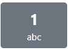

# COM528 AE1 Assessment Group A7

The team for this project (in alphabetical order) are:

| Name         | Student ID    | 
| :------------- | :----------: | 
| Jo Randall | 15191117  | 
| Jake Roblett  | 15002543 |
| Merlin Smith | 14803194 |
| Tom Strong | 15071278 |

**Important Links**

- [GitHub Repo](https://github.com/TomStrong/Com528-Assessment)

- [Design Documentation](https://github.com/TomStrong/Com528-Assessment/blob/main/docs/documentation.md)

## Point of Sale Application

This project is a simple Point of Sale web application, which allows configuration of the device via the administrator, and also allows the user to enter a payment or refund via the PoS interface. The transaction is then posted to the following bank client:

[Simple Bank Simulator](http://com528bank.ukwest.cloudapp.azure.com:8080/home)

The application then logs the response and displays on the PoS device whether the transaction has been approved or declined.

The application uses Enterprise Java Technologies with [Spring MVC framework](https://docs.spring.io/spring-framework/docs/3.2.x/spring-framework-reference/html/mvc.html) and [JavaServer Pages](https://www.oracle.com/java/technologies/jspt.html) for the front-end. [JavaScript](https://developer.mozilla.org/en-US/docs/Web/JavaScript) and [CSS](https://developer.mozilla.org/en-US/docs/Web/CSS) have been used to generate the UIs and validate user inputs. 

## System Requirements

This application has been designed and tested using the following, therefore it is recommended that these are used as a minimum:

- Windows 10 
- Java JDK v8
- Apache Maven 3.8
- Apache Tomcat 9.0
- Web browsers: Google Chrome, Mozilla Firefox, Microsoft Edge, Opera

>>**_NOTE:_**  
Please note, Internet Explorer is not supported and this application has not been tested in Safari, as the team does not have the facilities to do so.

## User Instructions

Before the application is run, ensure the following command is run in the folder *COM528-AssessmentGroupA7*:

```
mvn clean install
```

The application can now be opened in NetBeans. Once the web module has been run and the Tomcat server started, the web app will be launched on: 

[http://localhost:8080/Com528-Assessment/](http://localhost:8080/Com528-Assessment/)

The web app will open on the home page, where the user can navigate between Administrator and PoS device. If either button is clicked, a new web page will be opened.

### **Administrator**

To access the administrator page, use the following credentials:

<table>
  <tr>
    <th>Username</th>
    <td>admin</td>
  </tr>
  <tr>
    <th>Password</th>
    <td>admin</td>
  </tr>
</table>

The first time the application is launched, the form within the administrator page will auto populate with the data from [default.properties](https://github.com/TomStrong/Com528-Assessment/blob/main/COM528-AssessmentGroupA7/web/src/main/resources/default.properties). This can be configured to update the PoS with the current user's details.

All fields are required, except for the issue number, and the form will not submit without these. If this is attempted, an error message will be displayed.

### **Point of Sale Device**

The PoS device prompts the user to select either a payment or refund. Each step thereafter is the same, with the device prompting the user for input along the way.

The buttons on the device are updated depending on the field to input. For example, the amount, credit card number, cvv and issue number will only offer the user integer input, whereas the name will only offer characters. This has been automated in the JavaScript and cannot be overridden.

When prompted to enter a name, the keypad works similarly to a real-life keypad - using the below as an example, if the user wanted "b", they would press the button twice in quick succession. If they then wanted "a", they would wait for a couple of seconds before pressing the button again.


>Keypad example

The date will need to be entered in the format of MM/YY, otherwise the user will receive an prompt and the entry will not be accepted.

The action buttons on the device are as follows:

| Button        | Action    | 
| :-------------: | :----------: | 
|  | Accept current input | 
|    | Back (input only) |
|   | Cancel transaction |

All fields are required, except for Issue Number, and will display an appropriate error message if no or invalid entry is made.

## Local Files

>>**_NOTE:_**  
The below is for guidance only and may differ depending on each computer's configuration.

For test transaction log, navigate to:

```
C: --> Users --> (username) --> AppDate --> Local --> Temp --> transactions.txt
```

For transaction log when server is running, navigate to: 

```
tomcat --> apache tomcat --> temp --> transactions.txt
```

For local properties file (once PoS device has been configured): navigate to: 

```
tomcat --> apache tomcat --> temp --> application.properties
```

## Javadocs

All classes written by the team within this application have been documented using Javadocs, and have been written in accordance with Oracle guidelines. For further information, click [here](https://www.oracle.com/uk/technical-resources/articles/java/javadoc-tool.html).

To generate these, navigate to the *COM528-AssessmentGroupA7* folder and enter the following into command prompt:

```
mvn javadoc:javadoc
```

>>**_NOTE:_**  
Javadocs for *client* and *card-checker* modules supplied by Craig Gallen have not been changed.